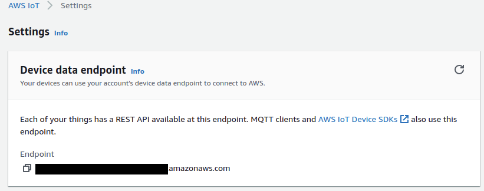
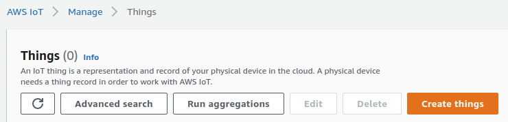
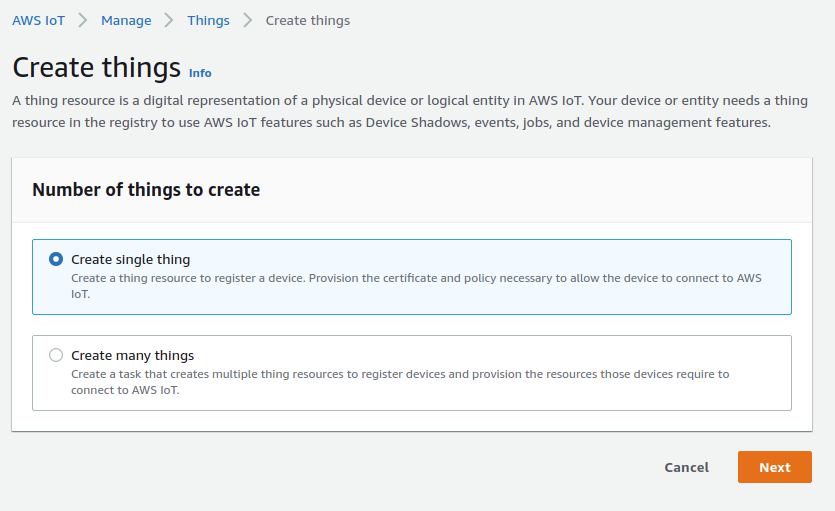
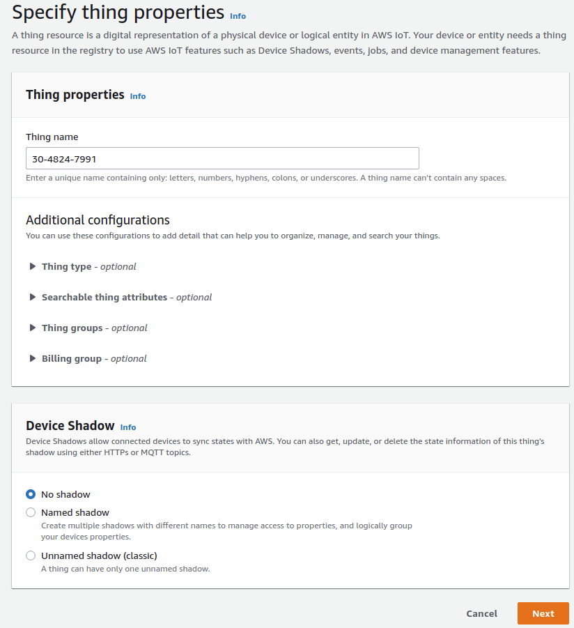
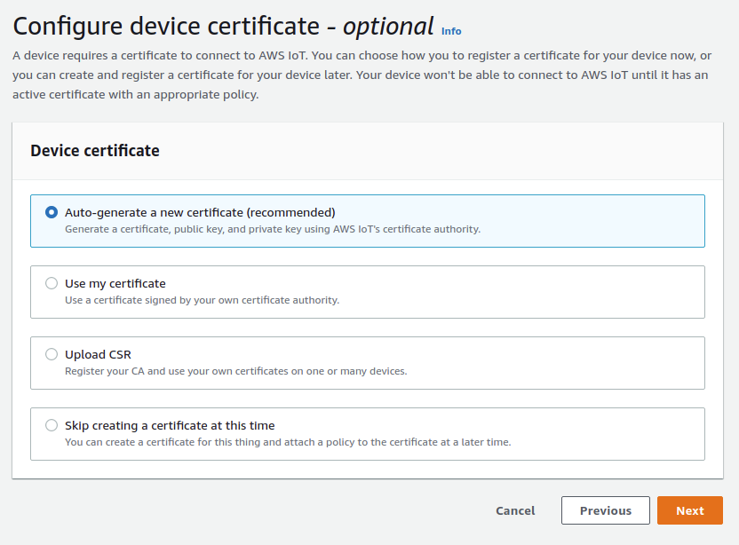
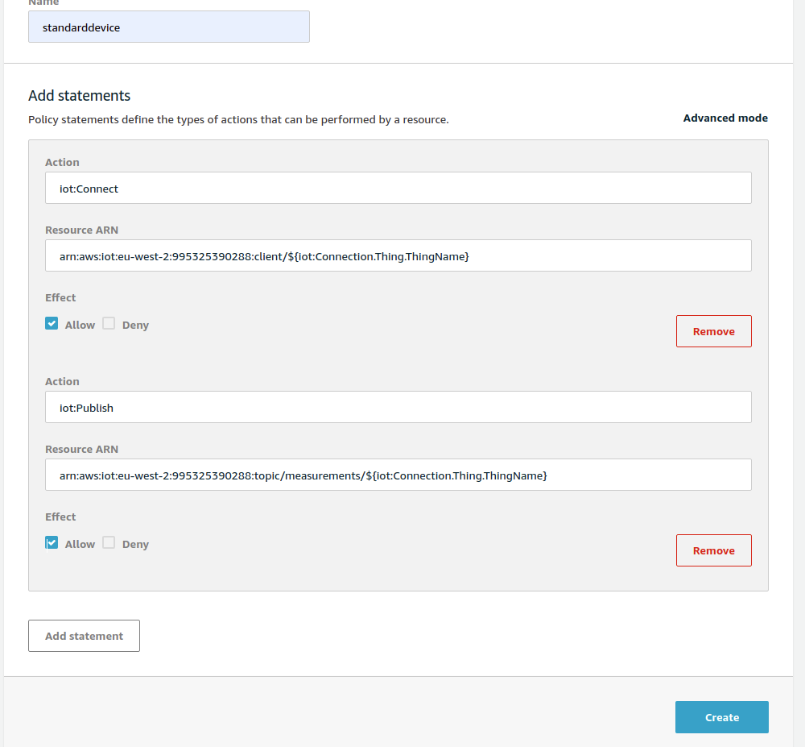
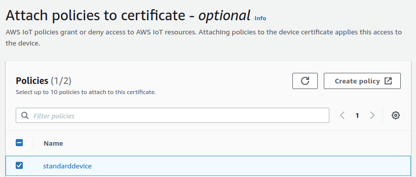
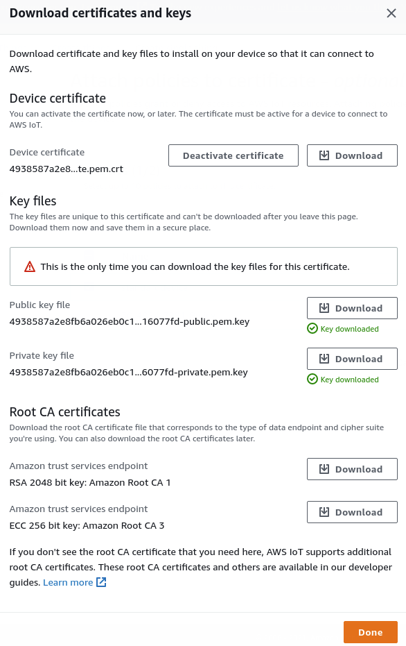

# INX AWS IoT
## Sign Up To IoT Core
Log in to your AWS account and sign up for IoT Core. Once you are signed up go in to the settings for your IoT Core and make a note of the end point address.

https://${region}.console.aws.amazon.com/iot/home?region=${region}#/settings

## Add A Thing To IoT Core
Click on Things in the left hand menu. Then click on Create Things.

Then choose Create Single Thing.

For the Thing name enter the unique ID of your device. It should be printed on the side and look something like XX-XXXX-XXXX.

Next choose auto generate new certificate.

Then choose create new policy. Add the following statements.
iot:Connect
${aws-iot-prefix}:client/${iot:Connection.Thing.ThingName}
iot:Publish
${aws-iot-prefix}:measurements/${iot:Connection.Thing.ThingName}

Go back to the tab with your add thing wizard. Then choose your newly created policy.

Now download the certificates for your device.

Rename the client certificate to client.pem. Rename the client key to client.key. Rename the Amazon trust services endpoint root CA to root.crt.

## Set up Lucid Application
Open the Lucid Application Builder and open the 
need to explain adding cert files to lab project
rename the certs to match the client parameters, normally client.pem, client.key, root.crt

update mqtt client config

then iot s3 bucket

then iot kinesis
then iot core rule
then quicksight (manifest.json)