# INX AWS IoT
## Sign Up To IoT Core
Log in to your AWS account and sign up for IoT Core. Once you are signed up go in to the settings for your IoT Core and make a note of the end point address.

https://${region}.console.aws.amazon.com/iot/home?region=${region}#/settings


## Add A Thing To IoT Core
Click on Things in the left hand menu. Then click on Create Things.


Then choose Create single thing


For the Thing name enter the unique ID of your device. It should be printed on the side and look something like XX-XXXX-XXXX.


Next choose auto generate new certificate.


Then choose create new policy. Add the following statements.
iot:Connect
${aws-iot-prefix}:client/${iot:Connection.Thing.ThingName}
iot:Publish
${aws-iot-prefix}:topic/measurements/${iot:Connection.Thing.ThingName}


Go back to the tab with your add thing wizard. Then choose your newly created policy.


Now download the certificates for your device.


Rename the client certificate to client.pem. Rename the client key to client.key. Rename the Amazon trust services endpoint root CA to root.crt.

## Set up Lucid Application
Open the Lucid Application Builder and open the inx-aws-iot.lpj. Then go to File and Import Resource File and choose the client.pem you downloaded earlier. Repeat this for client.key and root.crt.

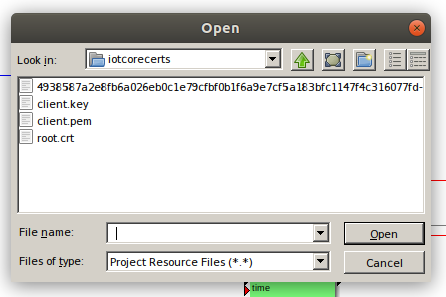

Then double click on the string constant to the left of the project that contains aws.mqtt.hostname and replace aws.mqtt.hostname with the endpoint address you copied earlier.

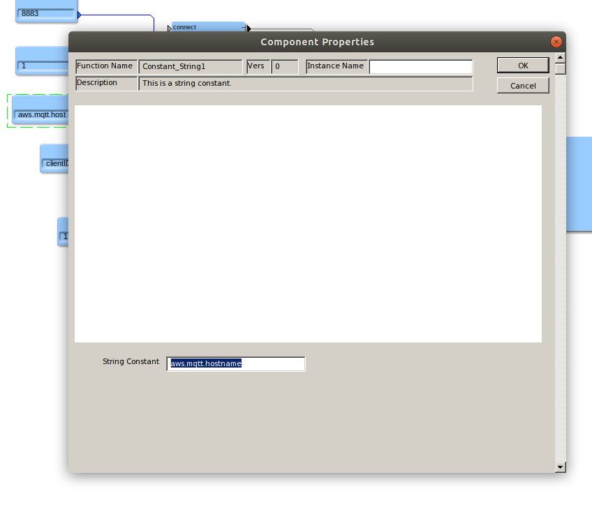

Now deploy the app to your device. You can find out the IP address of your device by looking at the front panel display. The top display in red should be displaying the last subnet of the IP address.

## Create an S3 bucket
Next we need to create an S3 bucket for the measurement data. In your AWS console go to the S3 service and create a new bucket in the same region as your IoT Core region.

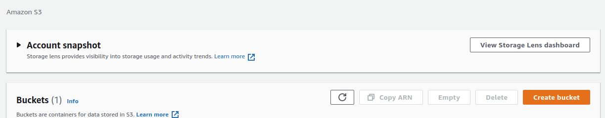

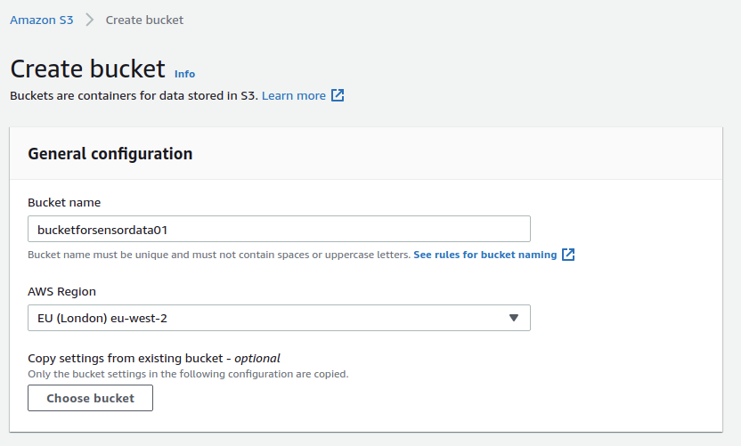

## Create a Kinesis Data Stream
Next we need to create a data stream to receive the measurement data. In your AWS console to go to the Kinesis service. Click data streams on the left hand side then click Create data stream. Give your data stream a name and then click Create data stream.

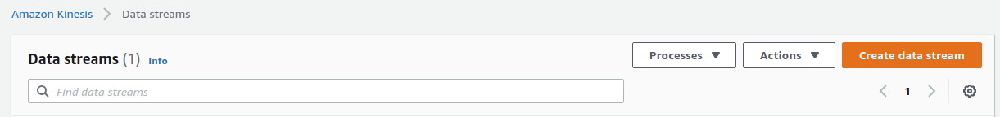

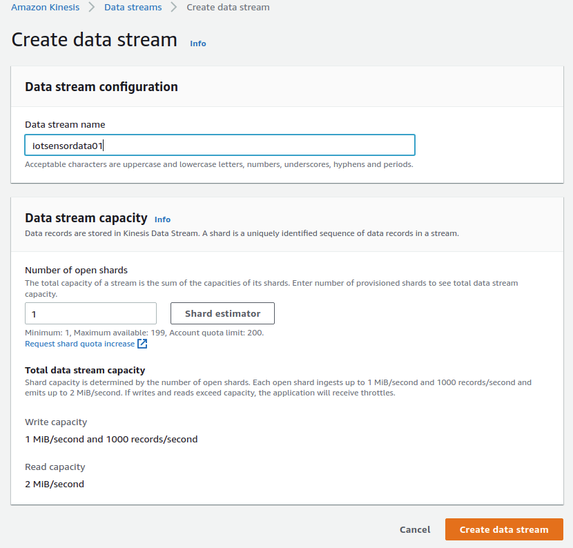

## Create a lambda function to transform the data
Now we need a Lambda function to add the client id to the data stream. Go to the Lambda service in your AWS console and click create function.

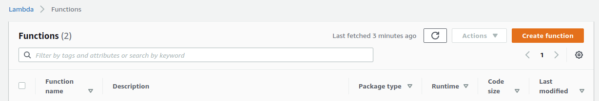

Choose use a blueprint then search for kinesis-firehose-process-record

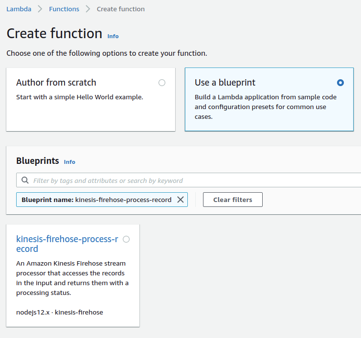

Give your function a name and leave the options as default then click create function.

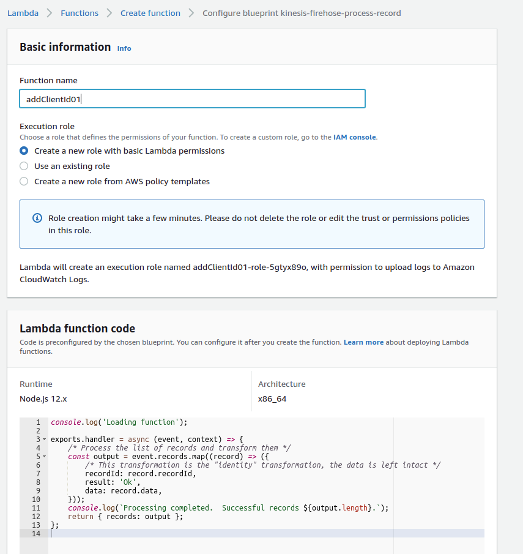

Once the function is created edit the code and replace it with
```
console.log('Loading function');

exports.handler = async (event, context) => {
    /* Process the list of records and transform them */
    const output = event.records.map((record) => {
        const data=JSON.parse((new Buffer(record.data, 'base64')).toString('utf8'));
        const deviceData=data.payload.split(',');
        const payloadString='{"c":"'+data.clientId+'","t":"'+deviceData[0]+'","pt100_1":'+deviceData[1]+'}'+"\n";
        const payload = (new Buffer(payloadString, 'utf8')).toString('base64');
        return {
            recordId: record.recordId,
            result: 'Ok',
            data: payload
        };
    });
    console.log(`Processing completed.  Successful records ${output.length}.`);
    return { records: output };
};
```

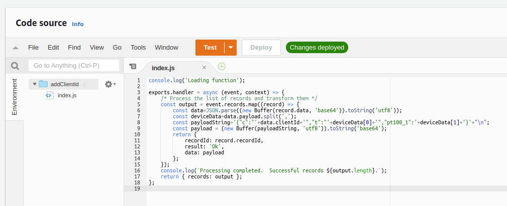

We then need to update the configuration of the function to have a 60 second time out.

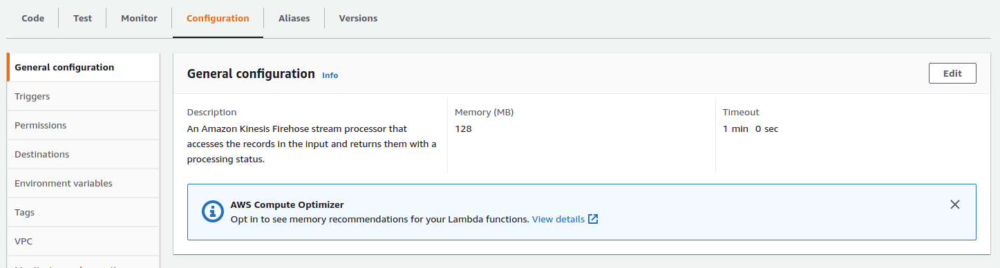

## Create a Kinesis Delivery Stream (Firehose)
We now need to create a Kinesis Delivery stream to push the data stream in to our S3 bucket. Go to the Kinesis service in the AWS console and then click on Delivery Streams then click on create delivery stream

For source choose "Amazon Kinesis Data Stream". For destination choose "Amazon S3". Then browse for your data stream you created earlier. Then give your delivery stream a name.

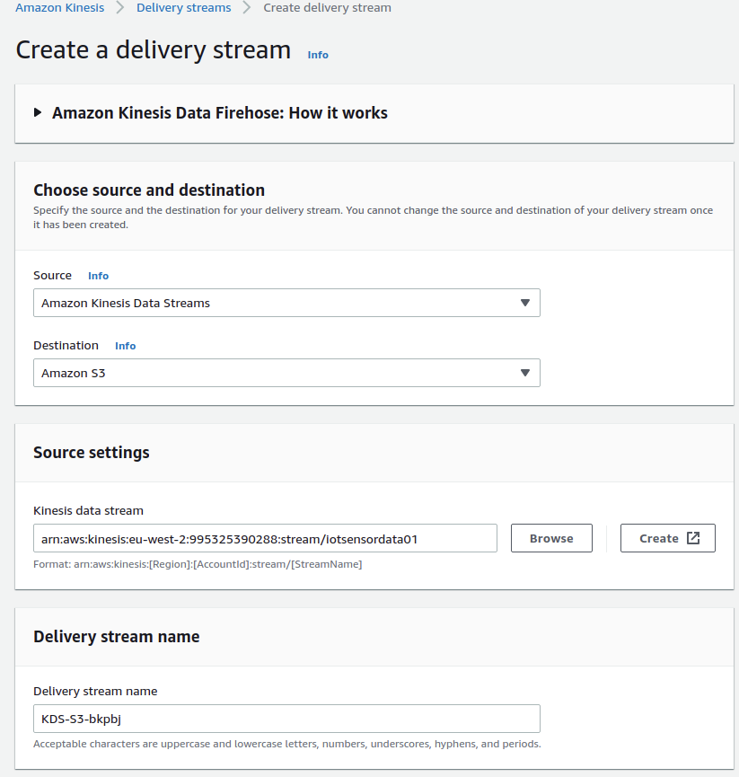

For data transformation choose enable. Then browse for the Lambda function you created earlier. Leave the other settings on their defaults.

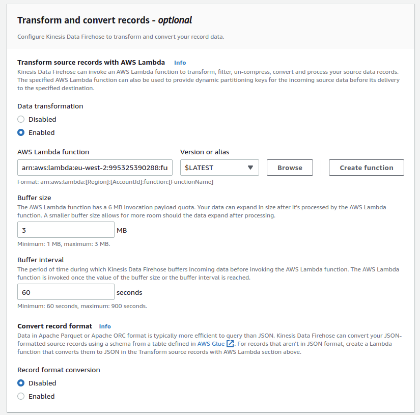

Then under destination browse for your S3 bucket you created earlier. Leave the other settings default then click create delivery stream.

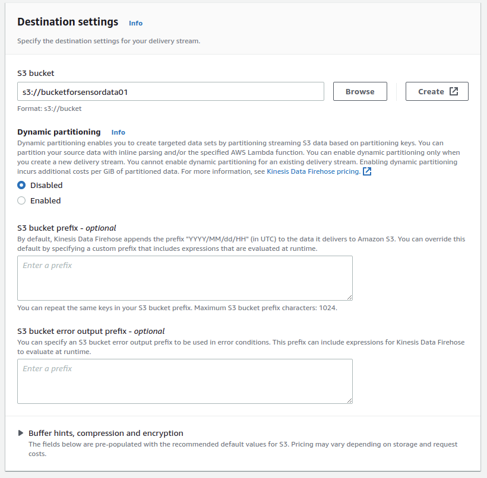

## Create an IoT core rule
We now need a IoT core rule to send the MQTT data to our Delivery Stream. Go to the IoT core service in your AWS console. Then click on Act then click on Rules then click on Create. Give the rule a name and a description. Set the rule query statement to 
```
SELECT decode(encode(*, 'base64'), 'base64') AS payload, clientid() as clientId FROM 'measurements/+'
```
Add an action and choose "Send a message to an Amazon Kinesis Stream", choose the data stream you created earlier. Set the partition key to `${newuuid()}`. Click "create role" for the permissions.

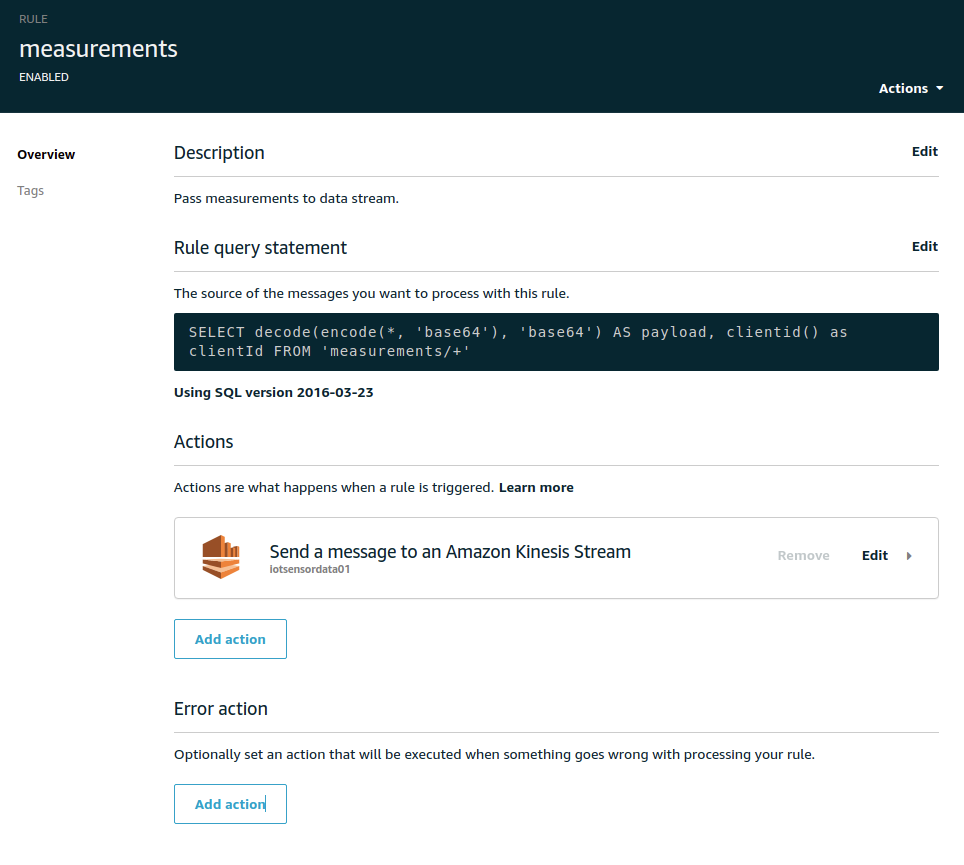

then quicksight (manifest.json)